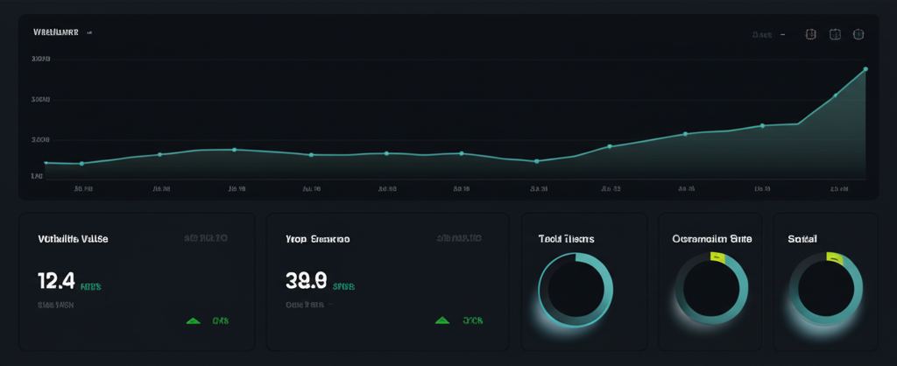

# StreamLine — Modern SaaS Landing (Next.js)

A polished, responsive landing site for a fictional SaaS, featuring tasteful motion, live charts, and a full set of marketing pages.



## Highlights

- Elegant, responsive layout with shadcn/ui components
- Framer Motion animations (scroll progress bar, staggered reveals, parallax blobs)
- Live hero chart using Recharts
- Accessible, semantic HTML with keyboard-friendly navigation
- Legal and company pages included: About, Careers, Press, Contact, Privacy, Terms
- Ready to deploy to Vercel

## Stack

- Next.js App Router (React Server Components friendly)
- Tailwind CSS (tokens via CSS variables in `app/globals.css`)
- shadcn/ui (pre-installed component primitives)
- Framer Motion (animations)
- Recharts (charts in hero)
- Lucide React (icons)
- next-themes + Geist fonts

## Routes

- `/` — Landing page
- `/about` — Company overview and values
- `/careers` — Open roles
- `/press` — Press kit and media mentions
- `/contact` — Contact form
- `/privacy` — Privacy policy
- `/terms` — Terms of service

## Quick start

Prerequisites: Node.js 18+ and a package manager (npm, pnpm, or yarn).

```bash
# install dependencies
npm i

# run dev server
npm run dev

# build for production
npm run build

# start production server
npm start
```

Open http://localhost:3000 in your browser.

## Project structure

```text
.
├─ app/
│  ├─ page.tsx                # Home
│  ├─ layout.tsx              # Root layout + fonts + globals
│  ├─ globals.css             # Tailwind + theme tokens (light/dark) + charts palette
│  ├─ about/                  # About page (+ loading.tsx)
│  ├─ careers/                # Careers page (+ loading.tsx)
│  ├─ press/                  # Press page (+ loading.tsx)
│  ├─ contact/                # Contact page (+ loading.tsx)
│  ├─ privacy/                # Privacy policy (+ loading.tsx)
│  └─ terms/                  # Terms of service (+ loading.tsx)
├─ components/
│  ├─ ui/                     # shadcn/ui primitives (button, card, input, etc.)
│  └─ theme-provider.tsx
├─ lib/utils.ts               # cn() helper
├─ public/                    # Images/assets
├─ streamline-landing.tsx     # Reusable Header, Footer, sections, motion helpers
├─ package.json               # Scripts & deps
└─ tsconfig.json
```

## Key features and where to edit

- Header and Footer (shared across pages): `streamline-landing.tsx` (exported `Header`, `Footer`)
- Animations:
  - Scroll progress bar in header via Framer Motion: `Header()` in `streamline-landing.tsx`
  - Parallax gradient blobs: `AnimatedBackground()` in `streamline-landing.tsx`
  - Section reveals: motion variants `fadeUp` and `revealOnce`
- Live chart (hero): `ChartCard()` in `streamline-landing.tsx`
  - Chart UI helpers: `components/ui/chart.tsx` (ChartContainer, Tooltip, Legend)
- Forms:
  - Hero CTA email capture: `FinalCta()` in `streamline-landing.tsx` (client-side placeholder)
  - Contact form: `app/contact/page.tsx` (client-side placeholder)

## Customize the theme

All primary tokens live in `app/globals.css` using CSS variables (OKLCH). Update brand accents or charts by changing these:

- Brand accent examples:
  - Emerald accents in the UI are applied via Tailwind classes (e.g., `bg-emerald-600`) and by tokens for charts (`--chart-*`).
- Chart colors:
  - See `--chart-1` through `--chart-5` in `app/globals.css`.
- Radius and focus rings:
  - `--radius`, `--ring`, etc., in `app/globals.css`.

Tip: Keep light/dark pairs in sync (the `.dark` values) to preserve contrast.

## Hook up forms (server actions example)

You can wire the CTA or contact form to a real backend using a Next.js Server Action:

```ts
// app/actions/subscribe.ts
'use server'

export async function subscribe(formData: FormData) {
  const email = String(formData.get('email') || '')
  // TODO: validate, then store in DB or send to provider
  // e.g., Supabase / Neon / external API
  return { ok: true, email }
}
```

Then bind it in a client component:

```tsx
'use client'
import { useActionState } from 'react'
import { subscribe } from '@/app/actions/subscribe'

export function SubscribeForm() {
  const [state, action, pending] = useActionState(subscribe, null)
  return (
    <form action={action} className="flex gap-2">
      <input name="email" type="email" required className="border px-3 py-2 rounded-md" />
      <button disabled={pending} className="bg-emerald-600 text-white px-4 py-2 rounded-md">
        {pending ? 'Submitting…' : 'Start free'}
      </button>
      {state?.ok && <p className="text-xs text-emerald-700">Thanks {state.email}!</p>}
    </form>
  )
}
```

Replace TODOs with your storage or email provider of choice.

## Accessibility

- Semantic landmarks: `header`, `main`, `footer`
- Keyboard focus styles on interactive elements
- ARIA labels for icon-only controls and nav menu
- Prefers-reduced-motion friendly animations (Framer Motion eases, short durations)

## Performance

- Animations are unobtrusive and scoped
- Chart renders with lightweight config and small dataset
- Images under `public/` are served statically; optimize or replace with your own assets for production

## Deployment (Vercel)

1. Push this repository to GitHub/GitLab/Bitbucket.
2. Import the repo on Vercel and deploy.
3. Set any environment variables you add in Settings → Environment Variables.

Or use the Deploy button from your editor/preview.

## Scripts

```bash
npm run dev     # start development server
npm run build   # build production bundle
npm start       # run production server
npm run lint    # lint (if configured)
```

## Notes

- The current build has no required environment variables.
- Replace placeholder images/logos in `public/` as needed.
- Update legal copy in `/privacy` and `/terms` for your organization.

## License

MIT (replace with your company license or terms)

*Automatically synced with your [v0.dev](https://v0.dev) deployments*

[](https://vercel.com/v-chaitanya-chowdaris-projects/v0-modern-landing-page-design)
[](https://v0.dev/chat/projects/lLryVxyWot0)

## Overview

This repository will stay in sync with your deployed chats on [v0.dev](https://v0.dev).
Any changes you make to your deployed app will be automatically pushed to this repository from [v0.dev](https://v0.dev).

## Build your app

Continue building your app on:

**[https://v0.dev/chat/projects/lLryVxyWot0](https://v0.dev/chat/projects/lLryVxyWot0)**

## How It Works

1. Create and modify your project using [v0.dev](https://v0.dev)
2. Deploy your chats from the v0 interface
3. Changes are automatically pushed to this repository
4. Vercel deploys the latest version from this repository
